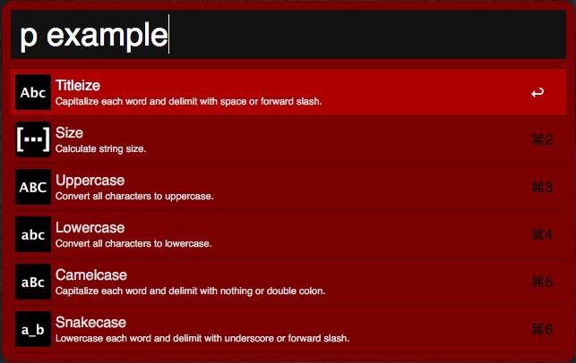

# Pennyworth

A command line interface that enhances and extends Alfred with Ruby support.

<!-- Tocer[start]: Auto-generated, don't remove. -->

# Table of Contents

- [Features](#features)
- [Requirements](#requirements)
- [Setup](#setup)
- [Usage](#usage)
- [Tests](#tests)
- [Versioning](#versioning)
- [Code of Conduct](#code-of-conduct)
- [Contributions](#contributions)
- [License](#license)
- [History](#history)
- [Credits](#credits)

<!-- Tocer[finish]: Auto-generated, don't remove. -->

# Features

- Adds Ruby support to Alfred.
- Adds Alfred Workflow:

      

# Requirements

0. [macOS](https://www.apple.com/macos).
0. [Alfred](https://www.alfredapp.com) (Version 2.x.x or higher).
0. [Alfred Powerpack](https://www.alfredapp.com/purchase).
0. [rbenv](https://github.com/sstephenson/rbenv).
0. [Ruby 2.x.x](https://www.ruby-lang.org).

# Setup

For a secure install, type the following from the command line (recommended):

    gem cert --add <(curl --location --silent https://www.alchemists.io/gem-public.pem)
    gem install pennyworth --trust-policy MediumSecurity

NOTE: A HighSecurity trust policy would be best but MediumSecurity enables signed gem verification while
allowing the installation of unsigned dependencies since they are beyond the scope of this gem.

For an insecure install, type the following (not recommended):

    gem install pennyworth

You can configure common settings for future gem builds by creating the following file:

    ~/.pennyworthrc

...using the following settings (for example):

     ---
     :alfred_settings_root: "/Users/bkuhlmann/Dropbox/Cache/Alfred/Alfred.alfredpreferences"

# Usage

From the command line, type: pennyworth

    pennyworth -c, [--config]        # Manage gem configuration.
    pennyworth -h, [--help=COMMAND]  # Show this message or get help for a command.
    pennyworth -i, [--install]       # Install Alfred Workflows.
    pennyworth -s, [--string=VALUE]  # Manipulate strings.
    pennyworth -v, [--version]       # Show gem version.

For string options, type: pennyworth help string

    -d, [--downcase], [--no-downcase]    # Downcase string.
    -u, [--upcase], [--no-upcase]        # Upcase string.
    -t, [--titleize], [--no-titleize]    # Capitalize each word and delimit with space or forward slash.
    -c, [--camelcase], [--no-camelcase]  # Capitalize each word and delimit with nothing or double colon.
    -s, [--snakecase], [--no-snakecase]  # Downcase each word and delimit with underscore or forward slash.
    -s, [--size], [--no-size]            # Calculate string size.

While the command line options are nice, the real power comes from running the following command:

    pennyworth -i

...which installs the Alfred Workflows to support this gem. You can use the Alfred commands
provided by each workflow instead of the CLI. Check each workflows documentation for details by
opening Alfred preferences and clicking on the _Workflows_ tab. Each workflow associated with this
gem is prefixed with _Pennyworth_.

# Tests

To test, run:

    bundle exec rake

# Versioning

Read [Semantic Versioning](http://semver.org) for details. Briefly, it means:

- Patch (x.y.Z) - Incremented for small, backwards compatible, bug fixes.
- Minor (x.Y.z) - Incremented for new, backwards compatible, public API enhancements/fixes.
- Major (X.y.z) - Incremented for any backwards incompatible public API changes.

# Code of Conduct

Please note that this project is released with a [CODE OF CONDUCT](CODE_OF_CONDUCT.md). By
participating in this project you agree to abide by its terms.

# Contributions

Read [CONTRIBUTING](CONTRIBUTING.md) for details.

# License

Copyright (c) 2012 [Alchemists](https://www.alchemists.io).
Read [LICENSE](LICENSE.md) for details.

# History

Read [CHANGES](CHANGES.md) for details.
Built with [Gemsmith](https://github.com/bkuhlmann/gemsmith).

# Credits

Developed by [Brooke Kuhlmann](https://www.alchemists.io) at [Alchemists](https://www.alchemists.io)
